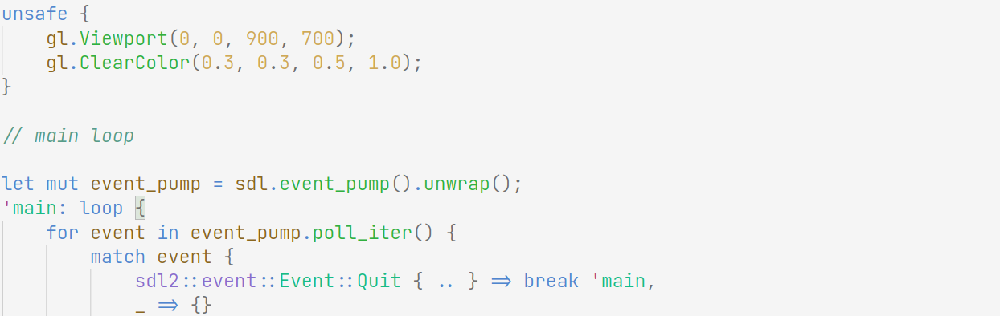

# Oak

The base theme is Oak, but there are Cherry and Dark versions. The Cherry theme is mostly the same, and the dark theme is meant to be used with about 20% window transparency.

Syntax theme is based on trees, water, and sky colors.
Background and editor colors are based on VsCode's Quiet Light and Dark+.

Colors should have the same semantics across languages marked as supported, with the exception of punctuation.

**Note**: Relies on semantic highlighting.
Make sure to **not** have `"semanticHighlighting": false` in your `"editor.tokenColorCustomizations"` (it is set to true in the theme).

## Supported Languages

- Javascript/HTML/CSS
- Python
- Java/C#
- C/C++
- Rust
- Go
- Sh/Bash
- Fish
- Scala
- Haskell/Purescript/Elm
- Nim
- Zig
- Graphviz
- Erlang
- Elixir

## Customizing

This theme is mostly syntax, so you can copy it into your settings as
tokenColor Customizations to use a different editor theme other than Quiet Light.

## Screenshots

Bash

---

C

---

Rust

---

Scala

---

Haskell

---

Json

---

Zig

