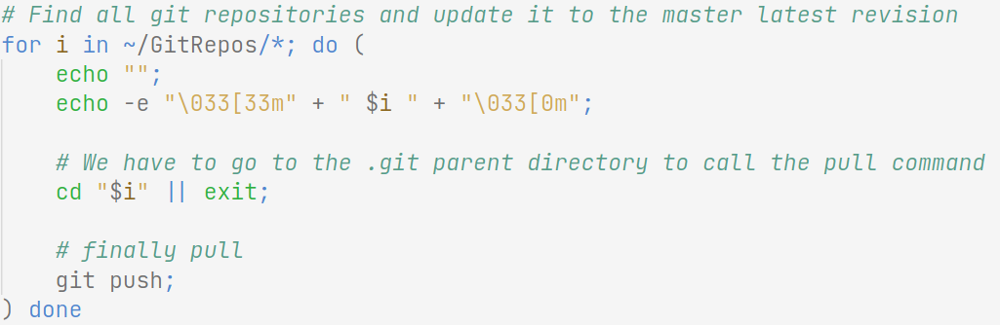
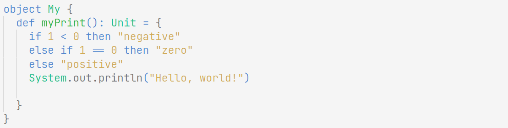
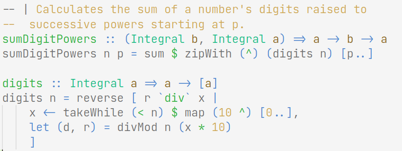
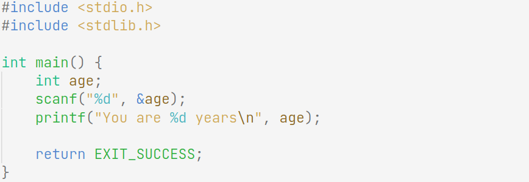
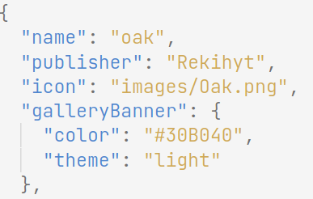
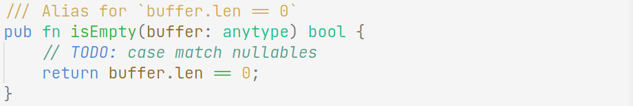

# Oak

Based on trees, water, and sky colors. Syntax highlighting only, using Quiet Light for background colors.

Colors should have the same semantics across languages marked as supported, with the exception of punctuation.

## Supported Languages

- Javascript / HTML / CSS
- Python
- Java / C#
- C/C++
- Rust
- Go
- Scala
- Haskell / Purescript / Elm
- Nim
- Fish
- Zig
- Graphviz

## Partial Support

- Erlang
- Elixir

## Customizing

This theme is syntax only, so you can freely copy it into your settings as
tokenColor Custumizations to use a different color theme instead of Quiet Light.

## Screenshots

Bash

---

Scala

---

Haskell

---

C

---

Json

---

Zig

