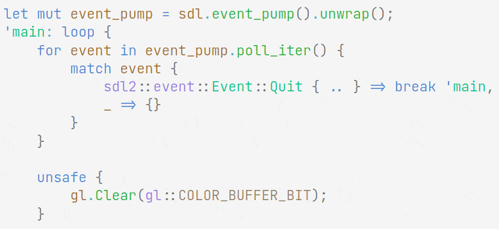

# Oak

The base theme is Oak, but there are Cherry and Dark versions. The Cherry theme is mostly the same, and the dark theme is meant to be used with about 20% window transparency.

Syntax theme is based on trees, water, and sky colors.
Background and editor colors are based on VsCode's Quiet Light and Dark+.

Colors should have the same semantics across languages marked as supported, with the exception of punctuation and operators.



---

## Supported Languages

- Javascript/HTML/CSS
- Python
- Java/C#
- C/C++ (If using MS cpp extension, you probably want to set `enhancedColorization` to "Disabled")
- Rust
- Go
- Sh/Bash/Fish
- Scala
- Haskell/Purescript/Elm
- Nim
- Zig
- Graphviz
- Erlang/Elixir

---

## Customizing

This theme is mostly syntax, so you can copy it into your editor settings as `tokenColorCustomizations` to use a different editor theme other than Quiet Light.

If you want to add another language, the most important step currently is setting "entity.name.function.\<lang\>" to "foreground": "#30B040", otherwise functions won't be highlighted.

Although Oak tries to be consistent, it sometimes comes at the cost of legibility. For example, literals are always yellow, including built-ins (like `null` or `true`). To get more standard behavior you can add a fontstyle like italic to `constant.language`, or even a different color:

```json
"[Oak]": {
    "textMateRules": [{
        "scope": "constant.language",
        "settings": {
            "foreground": "#5086ce",
            "fontstyle": "italic"
        }
    }]
},
"[Oak-Dark]": {
    "textMateRules": [{
        "scope": "constant.language",
        "settings": {
            "foreground": "#4e95e2",
            "fontstyle": "italic"
        }
    }]
},
```

For C/CPP: Syntax highlighting options for macros and their definitions isn't very good. Oak chooses to define little semantic highlighting in order to differentiate macro calls and macro constants. The trade off is that there is less colorization inside macro definitions.
